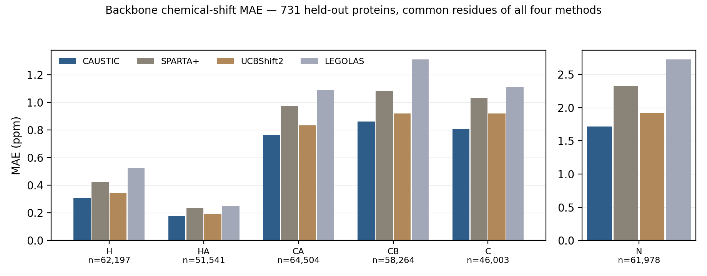

# CAUSTIC

**C**onformation-**A**ware **U**ncertainty and **S**hift predic**T**ion from prote**I**n **C**onformer ensembles

Predicts protein backbone NMR chemical shifts (H, HA, N, CA, CB, C') with per-residue
uncertainties from a PDB, mmCIF or AlphaFold structure. A 741,024-parameter PaiNN
equivariant graph neural network, trained on 3,433 BMRB-linked experimental structures
with carbon-aggressive label-noise cleaning; NMR ensembles are predicted as the median
over conformers.

<!-- DOI badge goes here after the Zenodo release -->
[](https://github.com/maxzinke/caustic-nmr/actions/workflows/ci.yml)
[](https://huggingface.co/spaces/SiXa18/caustic)

**[Try it in your browser](https://huggingface.co/spaces/SiXa18/caustic)** — no install needed.

## Install

```bash
pip install caustic-nmr
```

Python ≥ 3.10; Linux, macOS and Windows. The model weights and calibrator are inside the
package — nothing is downloaded at run time. PyTorch is a dependency (graph construction
uses it; inference itself runs on ONNX Runtime).

## 60-second example

```bash
caustic --version                      # package version, model SHA-256, calibrator
caustic 1ubq.pdb                       # NEF to stdout
caustic 1ubq.pdb --format csv -o 1ubq_shifts.csv
caustic AF-P01112-F1-model_v6.cif      # AlphaFold model: pLDDT read from the B-factor column
caustic ensemble.pdb --ensemble median # NMR ensemble: median over conformers (default)
```

```python
from caustic import predict_shifts_onnx
from importlib.resources import files

result = predict_shifts_onnx("1ubq.pdb", str(files("caustic.data") / "best_v2_carbons.onnx"))
result.mean["CA"]        # CA shifts (ppm), one per residue
result.std["CA"]         # per-residue sigma (ppm)
result.residue_names     # ['MET', 'GLN', 'ILE', ...]
result.provenance        # package version, model SHA-256, calibrator, date
```

Every output file carries the same provenance stamp in its header:

```
# caustic-nmr 0.4.0 model=best_v2_carbons.onnx sha256=ebc7bbc2fc59 calibrator=sa16_v2_carbons_slim date=2026-08-30T16:27:19Z
```

Inputs and outputs for ubiquitin and an AlphaFold model are in [`examples/`](examples/).

## Accuracy

Measured through this exact package (the released wheel, bundled weights, default
settings) on the 735-protein held-out test split, against SPARTA+ 2.90, LEGOLAS and
UCBShift2 in **full mode** (transfer module on), paired per residue:



| Nucleus (n residues) | CAUSTIC | SPARTA+ | LEGOLAS | UCBShift2 |
|---|---:|---:|---:|---:|
| H (62,197) | **0.309** | 0.426 | 0.525 | 0.343 |
| HA (51,541) | **0.175** | 0.233 | 0.251 | 0.192 |
| N (61,978) | **1.713** | 2.321 | 2.727 | 1.918 |
| CA (64,504) | **0.764** | 0.975 | 1.091 | 0.834 |
| CB (58,264) | **0.860** | 1.082 | 1.311 | 0.920 |
| C (46,003) | **0.804** | 1.029 | 1.109 | 0.919 |

MAE in ppm on the 344,487 residues all four methods predicted (731 proteins). Per-protein
composite, paired, with protein-level bootstrap CIs (Δ in ppm): **−25.9 %** vs SPARTA+
(Δ −0.276 [−0.318, −0.243]), **−35.3 %** vs LEGOLAS (Δ −0.429 [−0.450, −0.412]),
**−11.5 %** vs full UCBShift2 (Δ −0.102 [−0.127, −0.083]) — every per-nucleus CI
excludes zero. 67 of 693 test structures are
in UCBShift2's own reference database (where its transfer module excels); they are
*included*, so the UCBShift2 comparison is conservative against CAUSTIC. Protocol,
competitor versions, crash accounting and the fairness slices:
[docs/BENCHMARKS.md](docs/BENCHMARKS.md); regenerate everything with
`python benchmarks/rescore.py --bootstrap 2000`.

## Where the details are

| Question | Document |
|---|---|
| How does the model work, how was it trained? | [docs/METHOD.md](docs/METHOD.md) |
| What data, what split, what licences? | [docs/DATA.md](docs/DATA.md) |
| How were the numbers above measured, against which versions of which tools? | [docs/BENCHMARKS.md](docs/BENCHMARKS.md) |
| What does it not do? | [docs/LIMITATIONS.md](docs/LIMITATIONS.md) |
| Regenerate every table from the per-residue results | [benchmarks/README.md](benchmarks/README.md) |
| One protein end to end | [benchmarks/WALKTHROUGH.md](benchmarks/WALKTHROUGH.md) |
| What changed between versions | [CHANGELOG.md](CHANGELOG.md) |

## Output formats

| Format | Flag | For |
|---|---|---|
| NEF 1.1 (default) | `--format nef` | CCPN Analysis v3 and other NEF-aware software |
| NMR-STAR 3.x | `--format star` | BMRB deposition |
| CSV | `--format csv` | pandas / spreadsheets (`pd.read_csv(path, comment="#")`) |
| JSON | `--format json` | programmatic use (`provenance` object included) |

## Things to know

- One chain per call (`--chain`); other chains, ligands and waters are not in the graph.
- Missing backbone H/HA are synthesised from geometry (X-ray and AlphaFold inputs).
- Thirty non-standard residue names (MSE, HYP, SEP, TPO, PTR, CSO, PCA, …) are mapped to
  their parent residue; the modification itself is invisible to the model.
- Temperature is fixed at 298 K at inference; pH is not an input.
- σ comes from the network's uncertainty head; there is no pLDDT-dependent widening and no
  post-hoc isotonic calibration. See [LIMITATIONS.md](docs/LIMITATIONS.md) §4–5.
- The shipped model is ONNX-only; the `--backend torch` path cannot load it
  ([CHANGELOG](CHANGELOG.md), Known issues).

## Licence

Code: [MIT](LICENSE). Model weights and calibrator (`caustic/data/`):
[CC BY 4.0](LICENSE-WEIGHTS) — attribution *CAUSTIC model weights, Maximilian Zinke, 2026,
https://github.com/maxzinke/caustic-nmr*. Training data come from the BMRB and the wwPDB;
no BMRB records are redistributed ([DATA.md](docs/DATA.md) §6).

## Citation

See [CITATION.cff](CITATION.cff) (GitHub's "Cite this repository" button renders it).
<!-- Zenodo concept DOI and preprint go here once minted -->
