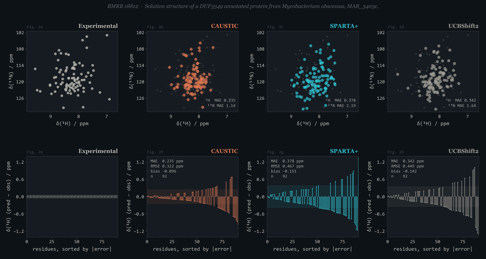
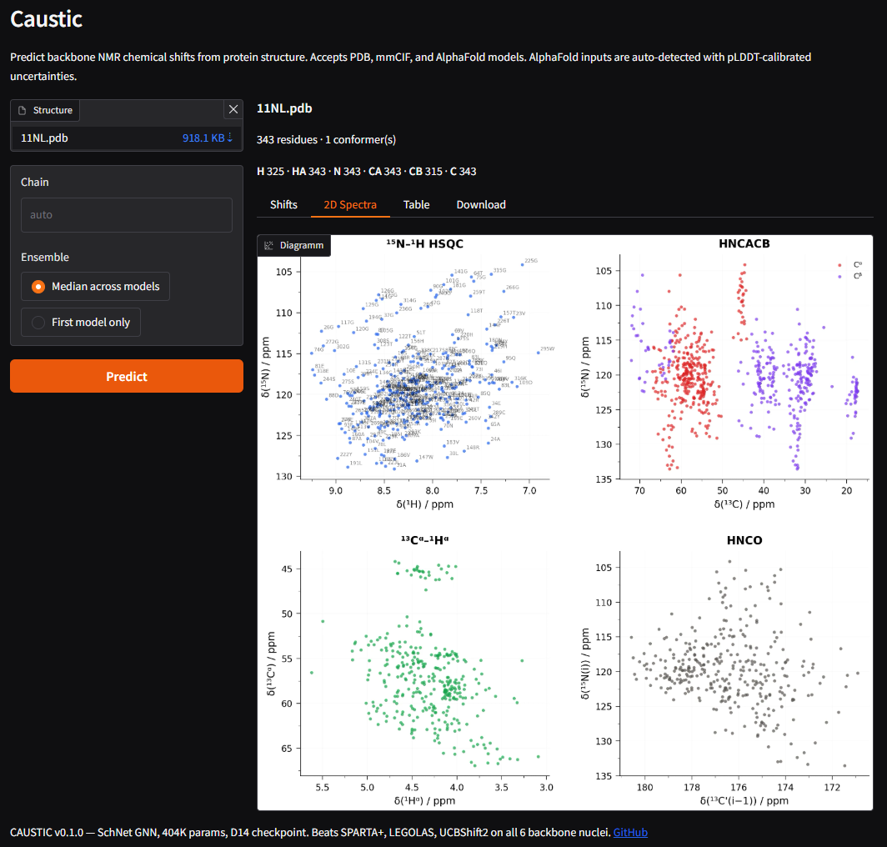

# CAUSTIC

**C**onformation-**A**ware **U**ncertainty and **S**hift predic**T**ion from prote**I**n **C**onformer ensembles

Predict NMR backbone chemical shifts (H, HA, N, CA, CB, C') from any PDB, mmCIF, or AlphaFold protein structure.

A ~740K-parameter **PaiNN equivariant** graph neural network trained on 3,400+ BMRB-linked experimental structures with carbon-aggressive label-noise cleaning. Beats SPARTA+, LEGOLAS, and UCBShift2 on all 6 backbone nuclei on a homology-separated test set (`cc.test`, n=735).

**v0.3.0** (2026-05-22) — Carbon predictions improved by retraining on cleaned labels: CA −5.7%, CB −5.5%, C −3.7% relative MAE on cc.test vs the previous PaiNN baseline. Net composite improvement **−4.37%** (paired bootstrap by protein, CI [−0.041, −0.024] excludes zero). H/HA/N unchanged — proton noise is biological (dynamics, exchange), not referencing drift; only carbons benefit from cleaning the systematic referencing offsets out of training.



[](https://huggingface.co/spaces/SiXa18/caustic)

**[Try it in your browser](https://huggingface.co/spaces/SiXa18/caustic)** — no install needed.

## Quick start

```bash
pip install caustic-nmr

# Predict shifts from a PDB file
caustic myprotein.pdb

# Output as CSV instead of NEF
caustic myprotein.pdb --format csv -o shifts.csv

# AlphaFold model — pLDDT-calibrated uncertainties applied automatically
caustic AF-P12345-F1-model_v4.cif
```

## Python API

```python
from caustic import predict_shifts_onnx
from importlib.resources import files

# v0.3.0 ships the carbon-cleaned PaiNN checkpoint inside the package
ckpt = files("caustic.data") / "best_v2_carbons.onnx"
result = predict_shifts_onnx("myprotein.pdb", str(ckpt))

# Per-residue arrays
print(result.mean["CA"])   # CA shifts in ppm
print(result.std["CA"])    # calibrated sigma
print(result.residue_names)  # ['MET', 'VAL', 'LEU', ...]
```

## Output formats

| Format | Flag | Use case |
|--------|------|----------|
| **NEF** (default) | `--format nef` | CCPN Analysis v3, modern NMR software |
| NMR-STAR 3.x | `--format star` | BMRB deposition |
| CSV | `--format csv` | pandas, Excel |
| JSON | `--format json` | programmatic consumption |

## Features

- **AlphaFold-aware**: auto-detects AF models, applies pLDDT-calibrated sigma widening
- **Missing hydrogens**: synthesises backbone H/HA from geometry when absent (X-ray PDBs, AF models)
- **Non-standard residues**: MSE, HYP, SEP, TPO, PTR, CSO, PCA, and 20+ more mapped to canonical parents
- **NMR ensembles**: median aggregation across conformers
- **Calibrated uncertainties**: isotonic CDF calibration on experimental structures, per-pLDDT scaling on AF inputs
- **NEF naming conventions**: GLY HA emitted as `HA%` (degenerate wildcard) per NEF v1.1 spec

## License

MIT
